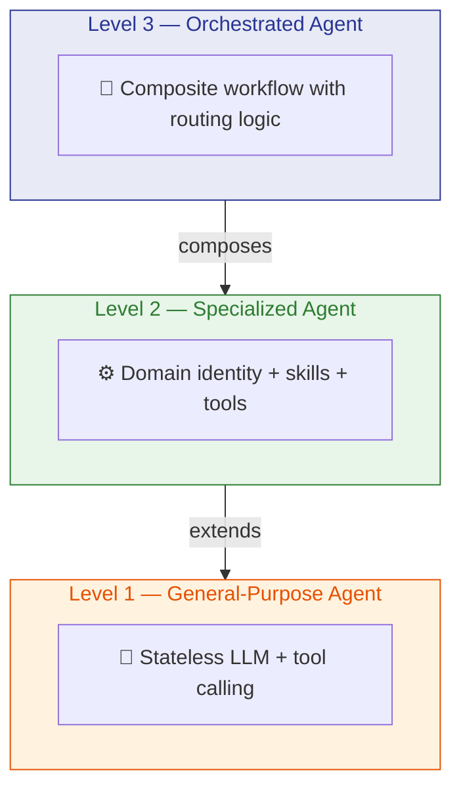
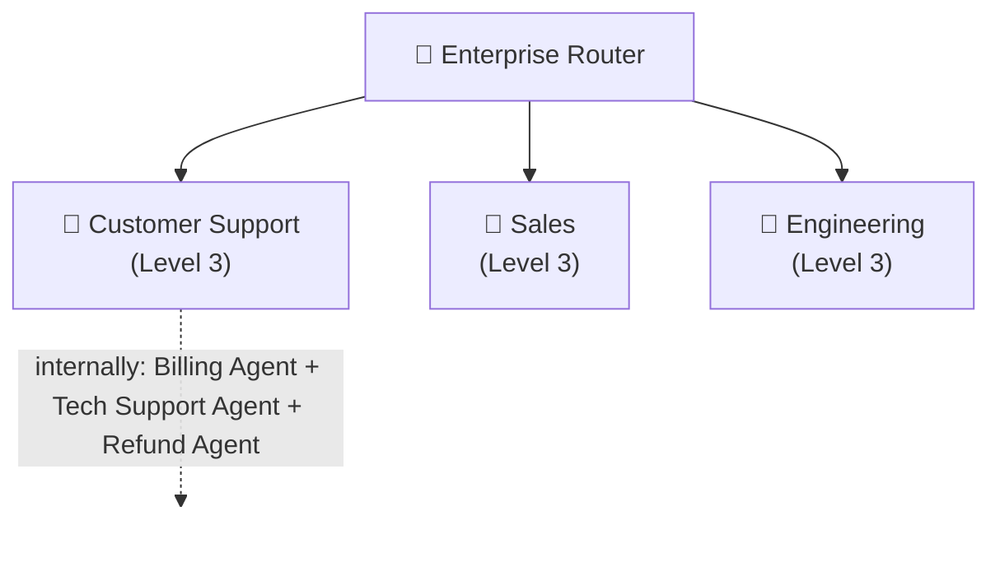

# Agent Architecture: A Hierarchical Perspective

> **Date:** July 2026

---

## 1. The Signal: OpenAI Is Deprecating Visual Agent Builder

OpenAI announced the **deprecation of Agent Builder** — shutdown **November 30, 2026.** ([source](https://developers.openai.com/api/docs/deprecations#2026-06-03-agent-builder))

Agent Builder is a visual canvas where users wire nodes together to build multi-step agent workflows. An Agent node defines instructions, tools, and model behavior, while other node types handle tools, logic, data, state, and human approval. Connect nodes with typed edges, add routing logic, publish as a deployable workflow.

**My interpretation: why deprecate the visual builder?** Three likely design signals:

1. **Natural language beats canvas.** Describing "build me a customer support agent" is easier than dragging nodes, configuring typed edges, wiring tools, and debugging traces.
2. **Configuration kills adoption.** The cognitive load of typed I/O, tool config, safety policies per node is too high for non-technical users.
3. **The long-term surfaces are shifting.** OpenAI is deprecating the visual authoring UI, while keeping deployment paths such as ChatKit and pointing users toward Agents SDK or ChatGPT Workspace Agents for migration.

> **Key takeaway:** The future of agent building is likely prompt-first or code-first. Visual canvas is more valuable as an inspection and debugging layer than as the primary authoring UX.

---

## 2. A Three-Level Framework for "Agent"

The word "agent" is overloaded — OpenAI uses agent-like concepts at both the node level and the workflow level. Here's a clean framework, explained once with the analogy built in:



| Level | Name | Execution Model | Definition | Analogy |
|:-----:|------|:---------------:|------------|---------|
| 1 | **General-Purpose** | **ReAct** | Stateless loop: Input → Think → Act → Observe → Output. Bare LLM + tool calling. No persona, no memory. | 👤 A person — has cognition and limbs, but no training |
| 2 | **Specialized** | **ReAct** | Level 1 + identity (system prompt) + domain skills + tools (MCP/APIs) + knowledge base. Purpose-built for a role: PM agent, dev agent, support agent. | 👨‍💼 A trained employee — the same person, now with professional skills |
| 3 | **Orchestrated** | **DAG** | A workflow graph of Level-2 agents with routing, conditions, and approval/state steps. Exposed as a **single unified interface**. Internal composition is hidden. | 🏢 A department — employees organized to handle a class of tasks. To the CEO, it's just "Finance." |

**Two execution patterns underpin this framework:**

- **ReAct** (Reasoning + Acting) powers Levels 1 & 2. A single agent loops: Think → Act → Observe → Think → … until done. This is how one agent solves a task independently.
- **DAG-style workflow** powers Level 3. Multiple agents are wired into a graph: A → B → C, with branching conditions (if X go to D, else go to E), and sometimes state or human approval steps. This is how agents collaborate on complex workflows.

**The core insight: a composed agent is still just an agent.** To an outside caller, an Orchestrated Agent looks no different from a Specialized Agent — both take input and return output. What happens inside (routing, sub-agents, state management) is hidden. This means agents can nest — just like a department can contain sub-departments.

**Applied to OpenAI Agent Builder:** Agent Nodes = Level 2 (employee factories). Other nodes provide tools, routing, state, transformation, and human approval. Workflow Canvas = Level 3 authoring (department builder). Published Workflow = Level 3 runtime (the department, consumed as a single capability). OpenAI operates primarily at Levels 2–3 because Level 1 is too raw to be a useful product building block.

---

## 3. Our Design Direction

### Natural language first, visual second

When a user says *"build me an agent that first classifies the request, then routes to billing or tech support based on intent"* — they are describing a **DAG**. Natural language is how humans naturally express graph structures ("first A, then B; if X go to C, else D"). Our job is to parse that into a Level-3 DAG, not to make users draw it by hand.

```
User: "Build a customer support agent that handles billing,
       tech support, and refunds."
          │
          ▼
System:  Parses the NL into a DAG → creates 3 Level-2 agents + routing + unified interface
          │
          ▼
Visual:  Renders the DAG for inspection & debugging (secondary, not primary)
```

OpenAI's migration direction supports this design bet. Don't make users configure typed edges by hand as the default path.

### Design for recursive composability from day one



Any agent should be usable as a sub-agent in a higher-order agent. An Orchestrated Agent is just a node to its parent.

### Hide complexity, expose capability

- **External consumers** call `agent.invoke(input)` — no visibility into sub-agents or routing
- **Agent builders** inspect the internal graph for debugging and optimization
- **Agents are versioned, shareable artifacts** — fork, compose, publish

### The hierarchy is a composition pattern, not a taxonomy

A "Product Manager Agent" is Level 2 when used directly. It's still Level 2 when placed inside a "Sprint Planning Dept" (Level 3). The parent context defines the orchestration level, not the agent itself.

---

## 4. Summary

| Principle | Implication |
|:----------|:------------|
| **ReAct → DAG** | Level 1–2 agents use ReAct (single-agent loop); Level 3 uses DAG (multi-agent graph) |
| **NL = DAG authoring** | Users describe graphs in natural language ("first A, then B; if X → C"); system parses it into a DAG |
| **Prompt-first authoring** | Users describe agents in natural language; visual canvas is for debugging only |
| **Three-level framework** | Shared vocabulary: General-Purpose → Specialized → Orchestrated |
| **Agents compose into agents** | Any agent can be a building block in a higher-order agent; internals stay hidden |
| **Learn from OpenAI** | Treat visual canvas as inspection/debugging, not the default creation path |

---
