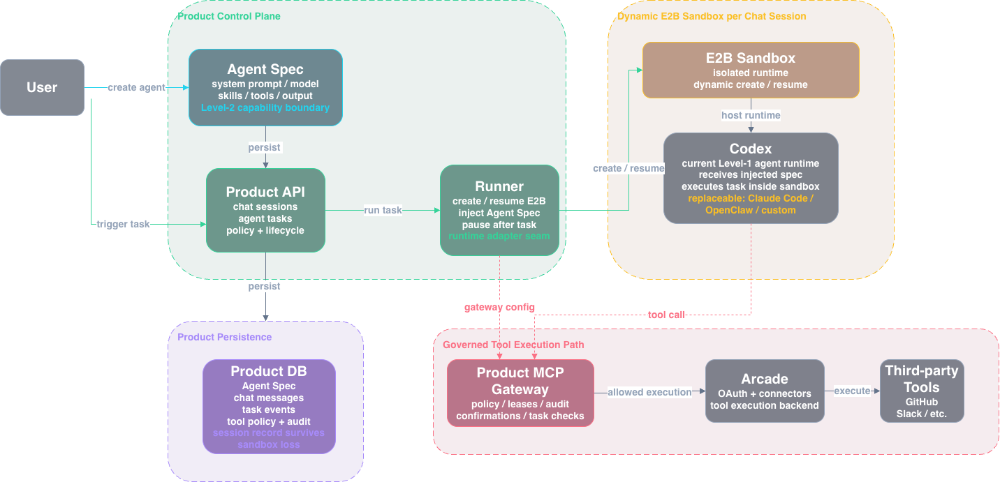
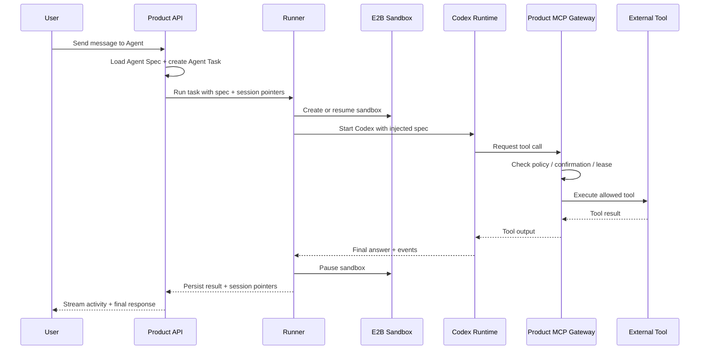
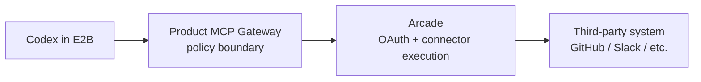

# Level-2 Agent Factory Technical Architecture

> **Date:** July 2026

---

## 1. Core Structure

This project is building a **Level-2 specialized agent factory**.

The current Level-1 agent runtime is **Codex**. Codex runs inside an **E2B sandbox** that is created dynamically for a user session. The product then wraps Codex with an agent spec: system prompt, model config, skills, and connected third-party tools.

Architecture overview:



The important point is:

> The user does not directly create a raw Codex runtime. The user creates a Level-2 agent spec, and the product injects that spec into Codex when the agent task starts.

---

## 2. Runtime Flow

When a user starts or continues a chat session:

1. The product loads the selected Agent Spec.
2. The API creates an Agent Task for the user message.
3. The runner creates or resumes an E2B sandbox for that chat session.
4. Codex starts inside the sandbox as the Level-1 runtime.
5. The product injects the Level-2 spec into Codex:
   - system prompt
   - selected LLM model
   - enabled skills
   - connected tools
   - output expectations
   - MCP gateway configuration
6. Codex performs the task inside the sandbox.
7. Tool calls go through the product MCP gateway.
8. The API streams task events back to the UI and persists the session record.
9. The sandbox is paused after completion and can be resumed for the next turn.



---

## 3. What Users Configure

When users create an Agent in this product, they are defining a **Level-2 capability boundary**.

They configure:

| Config | Purpose |
|--------|---------|
| System prompt | Defines the role, behavior, constraints, and working style |
| LLM model | Chooses the model used by the runtime |
| Skills | Adds reusable domain abilities or operating procedures |
| Connected tools | Grants access to third-party capabilities such as GitHub |
| Tool policy | Controls whether tools are unavailable, automatic, or confirmation-gated |
| Output format | Defines what kind of result the agent should produce |

This is the difference between a raw Level-1 agent and a specialized Level-2 agent:

- **Level 1:** Codex can reason, act, edit files, and use tools if available.
- **Level 2:** Product configuration tells Codex what role it is playing, what tools it may use, what boundaries it must respect, and how its work should appear to the user.

---

## 4. Safety And Elasticity

### E2B gives runtime isolation

Codex runs inside an E2B sandbox instead of directly inside the product server.

This gives the Level-1 runtime:

- physical/runtime isolation from the product API
- safer execution for file and command operations
- dynamic sandbox creation per session
- pause/resume support for follow-up turns
- a path to scale agent execution independently from the web/API tier

### The product keeps the user session record

The product database remains the source of truth for user-visible session history, messages, task state, tool policy, and audit data.

The sandbox can preserve execution context for Codex, but it is not the only place where user session state lives. This separation matters because sandboxes can expire, be paused, or be recreated, while the product should still retain the user's session record.

---

## 5. Tool Boundary

Third-party tools are not handed directly to Codex without product control.

Codex talks to the **Product MCP Gateway**, and the gateway decides whether a tool call is allowed for the current agent task.



The split is:

- **Product MCP Gateway:** policy, confirmations, leases, audit, task/session checks.
- **Arcade:** connector authorization and external tool execution.

This keeps Level-2 agent behavior governed by the product, even when external tool execution is delegated to Arcade or another provider.

---

## 6. Runtime Pluggability

Codex is the current Level-1 runtime, but the architecture should not depend on Codex forever.

Later, the same Level-2 agent spec could be injected into another runtime:

| Runtime | Role |
|---------|------|
| Codex | Current Level-1 code-agent runtime |
| Claude Code | Possible alternative runtime |
| OpenClaw | Possible open-source runtime |
| Custom agent runtime | Future product-owned runtime |

This makes the product a specialized-agent factory rather than a Codex-only wrapper.

The long-term abstraction is:

```text
Agent Spec + Runtime Adapter + Sandbox + Tool Gateway = Specialized Agent
```

---

## 7. Main Technical Bet

The main bet is that a strong Level-2 agent product can be built by combining:

- **safe Level-1 execution:** Codex inside E2B sandbox
- **elastic runtime lifecycle:** create, pause, resume, and recover sandboxes per session
- **flexible specialization:** system prompt, model, skills, and tools as configurable agent spec
- **product-owned tool governance:** MCP gateway for permissions, confirmations, and audit
- **runtime pluggability:** Codex today, other agent runtimes later

This gives the project two strong properties:

1. **Level-1 safety and elasticity:** execution happens in isolated, dynamically created sandboxes.
2. **Level-2 flexibility:** users can create many specialized agents by changing the spec, without rebuilding the runtime.

---
